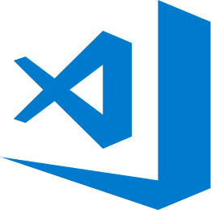

## :shipit: Hello my fellow, I’m Wesley Jr.

```rust
fn main() {
    println!("Welcome to my profile!");
}
```

- 💕 I’m interested in anime, manga, games, RPG, music and coffee!
- 🧑‍💼 I'm currently unemployed.
- 📖 I’m currently learning C, JavaScript and Node.js.
- ⚒️ I’m looking to collaborate in games, operating systems, community open-source projects, etc.
- 💻 You can check my **Computer Science Roadmap** progress [here](https://github.com/wesleyjrz/cs-roadmap).

### Contact me:

[](mailto:wesleyjr2002@gmail.com)
[](https://www.facebook.com/wesleyjrz)
[](https://discordapp.com/users/860287315866812436)
[](https://t.me/wesleyjrz)
<br />
<br />

### Languages and Tools:

[](https://code.visualstudio.com)
[](https://atom.io)
[](https://www.vim.org)
[](https://developer.mozilla.org/en-US/docs/Web/HTML)
[](https://developer.mozilla.org/en-US/docs/Web/CSS)
[](https://sass-lang.com)
[](https://developer.mozilla.org/en-US/docs/Web/javascript)
[](https://www.gnu.org/software/gnu-c-manual/gnu-c-manual.html#Data-Types)
<br />
<br />


> “Most of the good programmers do programming not because they expect to get paid or get adulation by the public, but because it is fun to program.”
> \- [Linus Torvalds](https://en.wikipedia.org/wiki/Linus_Torvalds)

<br />
